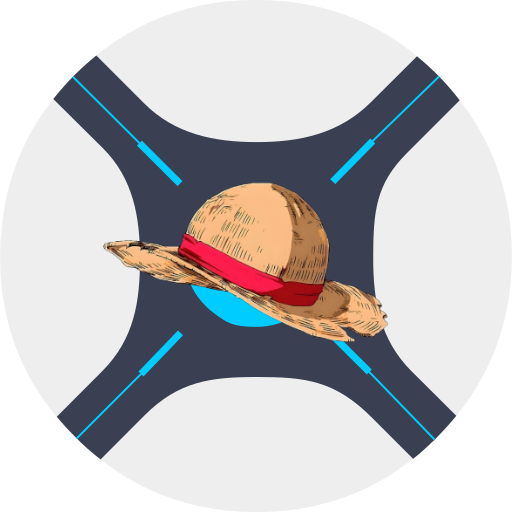

<div align="center">



# Anidarr

**The Ultimate PVR for Anime Enthusiasts.**

[](LICENSE)
[](https://dotnet.microsoft.com/)
[](https://reactjs.org/)

Anidarr is a specialized fork of [Sonarr](https://github.com/Sonarr/Sonarr) designed from the ground up to solve the unique challenges of organizing and automating anime collections. It bypasses TVDB and Skyhook, directly integrating with native anime metadata providers to give you faster, more accurate, and more comprehensive anime indexing.

</div>

---

## ✨ Features

Anidarr brings several anime-first features that aren't available in standard Sonarr:

### 🎭 TVDB-First, AniDB-Powered Fallback
Most anime already exists on TVDB, so Anidarr keeps TVDB as its primary provider — no surprises for series you already track. For the titles TVDB doesn't have (or hasn't matched), Anidarr automatically falls back to AniDB to fill the gap, without ever overwriting a valid TVDB match. If TVDB later picks up a match for a fallback series, TVDB data takes over automatically.

### ⚡ Lightning-Fast Local Search
By integrating the [Anime Offline Database](https://github.com/manami-project/anime-offline-database), searches for new anime happen locally via a cached SQLite database — no live API calls, no rate limits, instant results while you type. "All," "TVDB," and "AniDB" search filters all work as expected, with results deduplicated so you never see the same show listed twice.

### 🛡️ Strict, Centralized AniDB Rate Limiting
Every single AniDB API call in Anidarr — background scans, manual refreshes, relation lookups, everything — routes through one centralized rate-limiting gate enforcing a strict minimum interval between requests. If a background scan is mid-item when you manually request an AniDB lookup, Anidarr finishes that item, pauses the queue, runs your request next, then resumes — so you're never stuck waiting behind a long queue, and AniDB is never hit more than once at a time from anywhere in the app.

### 🖱️ Manual "Scan with AniDB"
Right-click the refresh button on the manual series-match screen to bring up a themed context menu with a dedicated **Scan with AniDB** option — a fast, explicit way to re-check AniDB without disturbing your TVDB match.

### 🧩 Automatic Season-Hub Grouping
AniDB models each season, sequel, and cour as its own separate entry — Anidarr automatically detects direct-continuation relations and merges them into a single hub series with proper numbered seasons, just like a native TVDB show. The chain is walked all the way back to the true first season, branching or ambiguous relations are flagged for manual review, and you can always see, override, or re-split the grouping yourself.

### 🎞️ Smart OVA & Specials Handling
Anidarr checks both AniDB's *relation type* and its *series type* before deciding where an entry belongs — genuine bonus OVAs/specials tied to an existing show land in Season 0, while standalone OVA releases with no qualifying parent show are added as their own normal series. Specials are pulled per-entry across every merged season and consolidated into one unified Season 0, matching TVDB's own default behavior.

### 🖼️ Consistent Hub Display, No Matter Which Season You Add
Add Season 2 or 3 of a show before Season 1? Anidarr still shows the hub series using Season 1's poster, title, and overview, and marks every season of that hub as "in library" the moment any one season is added — the same familiar behavior Sonarr users already expect from TVDB shows.

### 🔗 Full Per-Season AniDB Links
The series page's Links section lists every merged season's own AniDB ID and page link — not just Season 1's — since AniDB, unlike TVDB, gives each season its own unique ID.

### 🏷️ Alternate Titles & Synonyms
Anidarr parses and stores every title variant AniDB provides — English, Romaji, Kanji, and synonyms — not just the primary title, so search and automated parsing work no matter which name you use. A lightweight in-memory title cache keeps this instant even on very large libraries.

### 📅 Calendar Support with Accurate Air Times
AniDB-sourced series appear on the calendar alongside your TVDB shows. Since AniDB doesn't provide episode air *times*, Anidarr enriches episode dates with time-of-day data pulled from AniList's public API (itself rate-limited and cached independently of AniDB), giving you an accurate day-and-time calendar entry — and feeding Sonarr's normal RSS Sync/delay-profile pipeline so monitored AniDB episodes are automatically searched right on schedule, respecting your existing delay profiles exactly like any other series.

### 🔀 Rule-Based Release Selection (Optional Alternative to Points)
Tired of point values that don't behave the way you expect? Anidarr adds an optional, priority-ordered rule-list mode as an alternative to points-based custom format scoring — build an explicit if/else fallback chain ("try this group with dual-audio, then that group, then Japanese-only," and so on) with no scoring or guesswork. Every field supports free text with helpful defaults, and you can attach an existing points profile as a safety-net fallback for anything the rule list doesn't catch.

### 🔗 Bulk Hardlinking for Existing Files
Already have your library organized on disk? Select one or more series from the library page, choose a root folder in the Edit popup, and pick **Hardlink** instead of the default **Move** — Anidarr reuses its existing file-parsing and hardlink logic to bring your files into the library instantly, without the old Wanted → Manual Import detour.

### 🗂️ Enhanced Manual Import
We've streamlined the manual import process to make organizing straggling files more intuitive and accessible. Fast-access Manual Import buttons (featuring a custom stick-shift icon) are now placed prominently directly on episode rows and series details pages. The Interactive Import modal also features a seamless new "Pin Path" capability, allowing you to instantly bookmark and revisit your frequently used manual import folders with a single click, completely removing repetitive path typing and annoying popups.

### 💾 Dual-Mode Backup
Export a full Anidarr backup (including all AniDB metadata, hub/relations data, and rule-based release profiles), or export a **Sonarr-Compatible Backup** that strips out everything AniDB-specific — including Anidarr-only database schema changes — so you can restore your library into a vanilla Sonarr install if you ever want to move back.

### 🖥️ Full Multi-Platform Builds
Anidarr ships the same broad platform matrix as Sonarr — FreeBSD, Linux (glibc and musl, x64/arm/arm64), macOS (Intel and Apple Silicon, `.app` bundle or tarball), and Windows (x64/x86, installer or portable zip) — with SHA256 checksums for every release artifact.

## 🚀 Getting Started

Anidarr is built using .NET and React (via Yarn).

### Prerequisites

* [.NET 10.0 SDK](https://dotnet.microsoft.com/download)
* [Node.js](https://nodejs.org/) & Yarn

### Building from Source

1. Clone the repository:

```
git clone https://github.com/jt-ito/anidarr.git
cd anidarr
```

2. Build the Backend:

```
dotnet build src/Sonarr.sln -c Debug
```

3. Start the Backend Server:

   ```bash
   ./_output/net10.0/Sonarr.Console.exe
   ```

4. Install Frontend Dependencies & Start the Dev Server (in a new terminal):

```
cd frontend
yarn install
yarn start
```

5. Access Anidarr: Open your browser and navigate to `http://localhost:8989`.

## ⚙️ Configuration

Once installed, head over to **Settings > Metadata** to configure your AniDB client name and credentials. The UI links directly to AniDB (and, per-season, to each individual AniDB ID) instead of TVDB wherever a series is AniDB-sourced.

A few things worth knowing:

* **Rate limiting is automatic and non-configurable by design** — Anidarr enforces a strict minimum delay between AniDB requests to protect your account from being rate-limited or banned. This applies globally, across background scans and manual actions alike.
* **Root folders** must be configured under **Settings > Media Management** before adding series, same as stock Sonarr.
* **Release selection mode** (points-based or rule-based) can be set per quality profile under **Settings > Profiles**.
* **Backups** are available under **Settings > General > Backup**, with a choice between a full Anidarr backup or a Sonarr-compatible backup for migrating away.

### 🐳 Docker Compose Example

Here is a basic `docker-compose.yml` example to get you started:

```yaml
services:
  anidarr:
    image: jteaito/anidarr:latest
    container_name: anidarr
    environment:
      - PUID=1000
      - PGID=1000
      - TZ=Etc/UTC
    volumes:
      - /path/to/anidarr/config:/config
      - /path/to/media:/data # Must be a single mount for hardlinks!
    ports:
      - 8989:8989
    restart: unless-stopped
```

### 🐳 Docker: Hardlinks & Volume Mounts

If you're running Anidarr in Docker and want hardlinks to work (instead of slow, space-wasting file copies), **all paths must be accessible from a single volume mount**. The Linux kernel rejects hardlinks across different mount boundaries — even if both mounts point to the same physical drive.

**❌ Broken** — two separate mounts to the same drive:
```yaml
volumes:
  - /mnt/sda1/:/data
  - /mnt/sda1/downloads:/downloads
```
This creates two mount namespaces inside the container. Hardlinks between `/data/...` and `/downloads/...` will silently fail and fall back to copying.

**✅ Fixed** — one mount, everything underneath it:
```yaml
volumes:
  - /mnt/sda1/:/data
```
Your library folders (`/data/tv-shows/`, etc.) and download folder (`/data/downloads/`) are all under the same mount, so hardlinks work.

**If your download client reports a different path** (e.g., qBittorrent reports files at `/downloads/...` because its own container mounts the download directory there), add a **Remote Path Mapping** in Anidarr so it knows how to translate:

1. Go to **Settings → Download Clients → Remote Path Mappings**
2. Add a mapping:

   | Field | Value |
   |-------|-------|
   | **Host** | `localhost` (or whatever host your download client uses) |
   | **Remote Path** | `/downloads/` (the path your download client reports) |
   | **Local Path** | `/data/downloads/` (where that same directory lives under Anidarr's single mount) |

This tells Anidarr: "when the download client says a file is at `/downloads/something.mkv`, it's actually at `/data/downloads/something.mkv`" — keeping everything on one mount so hardlinks succeed.

## 🤝 Contributing

Anidarr is an open-source project and we welcome contributions! Whether it's fixing bugs, adding new metadata providers, or improving the React frontend, feel free to open a Pull Request.

## 📜 License

Anidarr is a fork of Sonarr and inherits its GPL-3.0 License. See the [LICENSE](https://github.com/jt-ito/anidarr/blob/master/LICENSE) file for more details.
